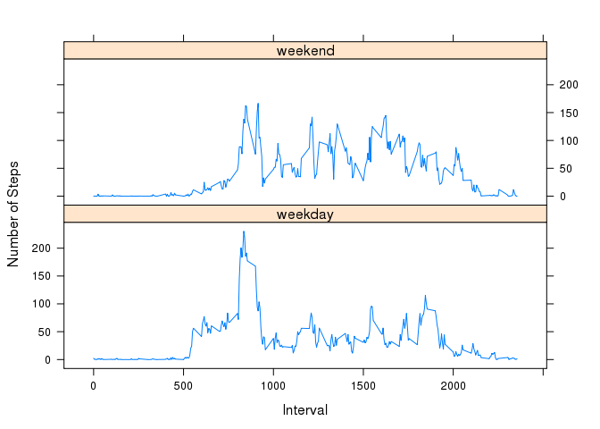

# Reproducible Research: Peer Assessment 1


## Loading and preprocessing the data


```r
# unzip the data file
unzip("activity.zip");

# read the file in
rawActivity<-read.csv("activity.csv");

# sanity check on the load
names(rawActivity);
```

```
## [1] "steps"    "date"     "interval"
```

```r
dim(rawActivity);
```

```
## [1] 17568     3
```

```r
# make a set with no NA's in the step column
validStepsOnly = rawActivity[!is.na(rawActivity$steps),];
```


## What is mean total number of steps taken per day?

First we will plot the total number of steps per day, excluding any NA values for steps.


```r
library(plyr)


# summarise the steps for each day and add back to the frame
sumValidSteps<-ddply(validStepsOnly,c("date"),summarise, sumSteps=sum(steps))


# make a histogram of the step sums
hist(sumValidSteps$sumSteps, main="Histogram of Total Number of Steps Taken Each Day",
     xlab="Total Steps per Day");
```

 


```r
# compute the mean and median for reporting in the main text
totalStepsMean <- mean(sumValidSteps$sumSteps);
totalStepsMedian <- median(sumValidSteps$sumSteps);
```

The mean of the total number of steps per day is 1.0766189\times 10^{4}.

The median of the total number of steps per day is 10765


## What is the average daily activity pattern?


```r
# get the mean steps per interval
averageStepsPerInterval <- ddply(validStepsOnly,c("interval"),summarise, meanSteps=mean(steps))

# plot it
plot(averageStepsPerInterval$interval, averageStepsPerInterval$meanSteps,type='l',
     main="Average Daily Activity Pattern", xlab="Interval", ylab="Mean steps")
```

 


```r
# get the interval with the max number of steps
maxStepIndex <- which.max(averageStepsPerInterval$meanSteps);
maxInterval <- averageStepsPerInterval$interval[maxStepIndex]; 
```

The interval with the maximum number of steps per day is 835.


## Imputing missing values


```r
# get the interval with the max number of steps
numNaSteps <- sum((is.na(rawActivity$steps))==TRUE);
numNaInterval = sum((is.na(rawActivity$interval))==TRUE);
numNaDate = sum((is.na(rawActivity$date))==TRUE);
```

The number of NA step is  2304.

The number of NA date is  0.

The number of NA interval is  0.


To fill in the missing values the mean for that interval will be used.


```r
# find any intervals with NA steps and replace those values with the mean for that interval
# with more time, replace this loop with an sapply or similar command

# make a copy that we will fill
filledActivity <- rawActivity;

for(i in 1:length(rawActivity$steps))
  {
    if( is.na(rawActivity$steps[i]))
    {
       
      newValue <- averageStepsPerInterval$meanSteps[ (averageStepsPerInterval$interval == 
                                            rawActivity$interval[i])];
      
      filledActivity$steps[i]<-newValue;
    }
  
  }

# diagnostic - verify that all the values have been fixed
#count( is.na(filledActivity$steps) )
```


Now the basic statistics of the new data set will be checked.


```r
# summarise the steps for each day and add back to the frame
sumFilledSteps<-ddply( filledActivity,c("date"),summarise, sumSteps=sum(steps))


# make a histogram of the step sums
hist(sumFilledSteps$sumSteps, main="Histogram of Filled Dataset Total Number of Steps Taken Each Day",
     xlab="Total Steps per Day");
```

 


```r
# compute the mean and median for reporting in the main text
totalStepsMeanFilled <- mean(sumFilledSteps$sumSteps);
totalStepsMedianFilled <- median(sumFilledSteps$sumSteps);

# compute the delta from the unfilled set

deltaMean <- totalStepsMean - totalStepsMeanFilled;
deltaMedian <- totalStepsMedian - totalStepsMedianFilled;
```

The mean of the total number of steps per day is 1.0766189\times 10^{4}.

The median of the total number of steps per day is 1.0766189\times 10^{4}


 

The differnces between the filled and original set means of the total number of steps per day is 0.

The differnces between the filled and original set median of the total number of steps per day is -1.1886792.


The impact on the mean is exactly zero as would be expected with a backfill using the mean from the intervals.   

The shift in the median is non-zero but vanishingly small given the total number of steps per day.   It is literally on order of a single missed step in a day.


 
## Are there differences in activity patterns between weekdays and weekends?


Generate a new version of the data set with a new column for "weekday" or "weekend".


```r
library(lattice)

# first generate the day of the week
filledActivity$day<- weekdays(as.Date(filledActivity$date));

# fill new column with default
filledActivity$weekday<-"weekday";

# now set either weekend or weekday
for(i in 1:length(filledActivity$day)){
  if(filledActivity$day[i] == "Sunday"){
    filledActivity$weekday[i] <- "weekend";
  }
  else if(filledActivity$day[i] == "Saturday"){
    filledActivity$weekday[i] <- "weekend";
  }
  # else leave it as the default weekday
}


# get the mean steps per interval
averageStepsPerWeekInterval<-ddply(filledActivity,c("weekday","interval"),summarise, meanSteps=mean(steps))


# do the plot
xyplot(   meanSteps ~ interval | factor(weekday)  ,
        data = averageStepsPerWeekInterval, type='l',
        xlab= "Interval", ylab = "Number of Steps");
```

 


